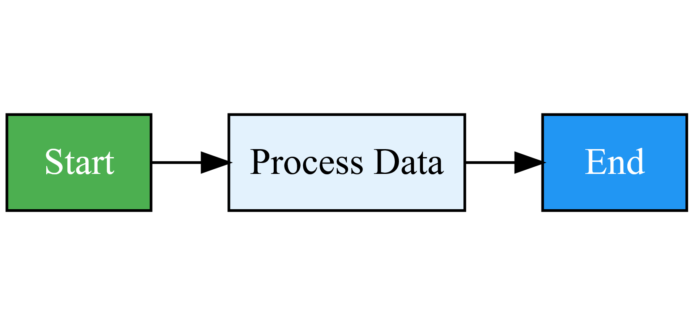
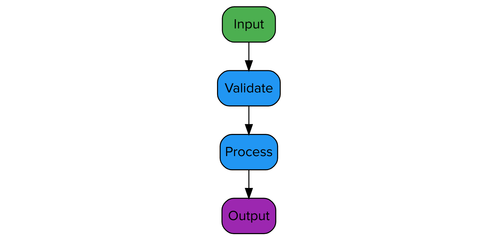

# DAG Viewer for Splunk

A custom visualization for Splunk Enterprise that renders Directed Acyclic Graphs (DAGs) using the GraphViz engine. Ideal for visualizing workflows, attack trees, dependency graphs, process flows, and network topologies.

Based on [dag-viewer-forked](https://codesandbox.io/p/sandbox/dag-viewer-forked-wl185q) from CodeSandbox.

---

## Screenshots

### Simple Workflow (Left to Right)



**SPL to generate this screenshot:**
```spl
| makeresults count=1
| eval dot="digraph { rankdir=\"LR\"; node [shape=\"box\" style=\"filled\" fillcolor=\"#E3F2FD\"]; Start [fillcolor=\"#4CAF50\" fontcolor=\"white\"]; Process [label=\"Process Data\"]; End [fillcolor=\"#2196F3\" fontcolor=\"white\"]; Start -> Process -> End; }"
```

---

### Attack Tree Visualization


**SPL to generate this screenshot:**
```spl
| makeresults count=1
| eval dot="digraph { rankdir=\"TB\"; node [shape=\"box\" style=\"filled, rounded\"]; Goal [label=\"Access Data\" fillcolor=\"#DB2955\" fontcolor=\"white\"]; Attack1 [label=\"Phishing\" fillcolor=\"#ED96AC\"]; Attack2 [label=\"Exploit Vuln\" fillcolor=\"#ED96AC\"]; Defense1 [label=\"Training\" fillcolor=\"#ABD2FA\"]; Defense2 [label=\"Patching\" fillcolor=\"#ABD2FA\"]; Goal -> Attack1; Goal -> Attack2; Attack1 -> Defense1; Attack2 -> Defense2; }"
```

---

### Structured Data Mode



**SPL to generate this screenshot:**
```spl
| makeresults | eval source="Input", target="Validate", source_color="#4CAF50", source_fontcolor="#fff"
| append [| makeresults | eval source="Validate", target="Process", source_color="#2196F3", source_fontcolor="#fff"]
| append [| makeresults | eval source="Process", target="Output", source_color="#2196F3", source_fontcolor="#fff", target_color="#9C27B0", target_fontcolor="#fff"]
| eval source_style="filled, rounded", target_style="filled, rounded", node_shape="box"
| fields source target source_color source_fontcolor source_style target_color target_fontcolor target_style node_shape
```

---

## Features

- Two input modes: Raw GraphViz DOT format or structured source/target fields
- Interactive zoom and pan (can be disabled via formatter)
- Configurable layout direction (Top-Bottom, Left-Right, Bottom-Top, Right-Left)
- Full node and edge styling support in structured mode
- Works in Classic Dashboards (SimpleXML)
- Reset View button to restore default zoom level

---

## Installation

### From Source (Build Required)

1. Clone this repository
2. Navigate to the visualization directory:
   ```bash
   cd viz_dag_viewer/appserver/static/visualizations/dag_viewer
   ```
3. Install dependencies:
   ```bash
   npm install
   ```
4. Build the visualization:
   ```bash
   npm run build
   ```
5. Copy the `viz_dag_viewer` folder to `$SPLUNK_HOME/etc/apps/`
6. Restart Splunk

### From Splunkbase

Download the pre-built package from Splunkbase and install via the Splunk UI.

---

## Usage

### Data Format Option 1: DOT Format

Return a single field named `dot` containing a GraphViz DOT string:

```spl
| makeresults count=1
| eval dot="digraph {
    rankdir=\"TB\";
    A [label=\"Start\"];
    B [label=\"Process\"];
    C [label=\"End\"];
    A -> B -> C;
}"
```

### Data Format Option 2: Structured Data

Return `source` and `target` fields to define edges:

```spl
| makeresults | eval source="A", target="B"
| append [| makeresults | eval source="B", target="C"]
| append [| makeresults | eval source="C", target="D"]
| fields source target
```

---

## Structured Mode Field Reference

### Required Fields

| Field | Description |
|-------|-------------|
| `source` | Source node ID |
| `target` | Target node ID |

### Optional Styling Fields

| Field | Description | Example |
|-------|-------------|---------|
| `label` | Edge label | "Step 1" |
| `source_color` | Source node fill color | "#4CAF50" |
| `source_fontcolor` | Source node text color | "#ffffff" |
| `source_style` | Source node style | "filled, rounded" |
| `target_color` | Target node fill color | "#DB2955" |
| `target_fontcolor` | Target node text color | "#ffffff" |
| `target_style` | Target node style | "filled, rounded" |
| `node_shape` | Node shape (both) | "box", "ellipse", "diamond" |
| `edge_color` | Edge line color | "#7692FF" |
| `edge_style` | Edge line style | "dashed", "dotted" |

---

## Formatter Options

Access via Format menu when editing a dashboard panel:

| Option | Values | Default | Description |
|--------|--------|---------|-------------|
| Zoom & Pan | On / Off | On | Enable mouse scroll zoom and drag to pan |
| Layout Direction | TB, LR, BT, RL | TB | Graph flow direction |
| Curved Edges | Yes / No | Yes | Use curved splines for edges |
| Prevent Overlap | Yes / No | Yes | Prevent nodes from overlapping |
| Node Spacing | number | 0.2 | Horizontal spacing between nodes |
| Rank Spacing | number | 0.4 | Vertical spacing between levels |

Values set directly in the DOT string take precedence over formatter options.

---

## Dashboard Reference

Use the visualization in Classic SimpleXML:

```xml
<viz type="viz_dag_viewer.dag_viewer">
    <search>
        <query>| your SPL here</query>
    </search>
    <option name="height">400</option>
</viz>
```

---

## Compatibility

- Splunk Enterprise 9.x, 10.x
- Classic Dashboards (SimpleXML)

---

## License

MIT License - see [LICENSE](LICENSE) file.

---

## Credits

- Original visualization: [dag-viewer-forked](https://codesandbox.io/p/sandbox/dag-viewer-forked-wl185q)
- GraphViz rendering: [graphviz-react](https://github.com/nicksenger/graphviz-react), [d3-graphviz](https://github.com/magjac/d3-graphviz)
- Splunk template: [splunk-viztemplate](https://github.com/jpvlsmv/splunk-viztemplate)

